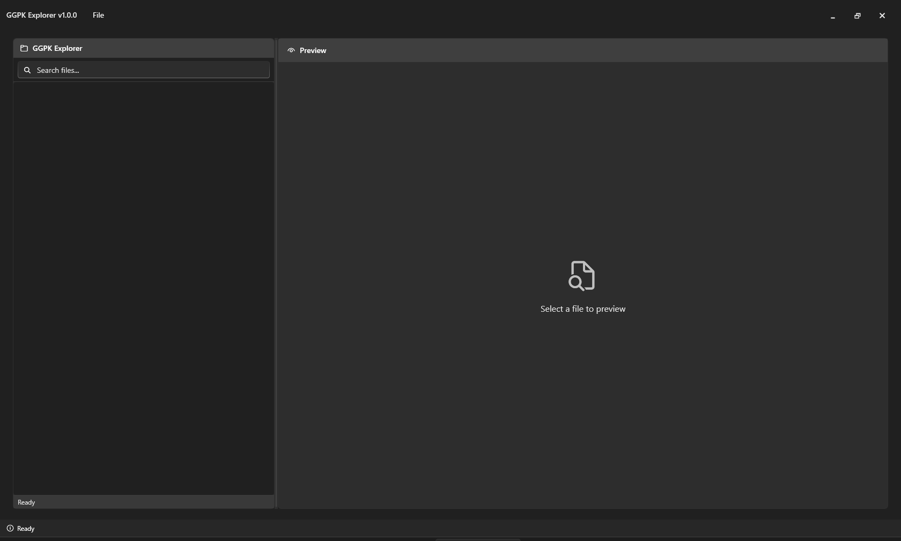

# GGPK Explorer v1.0.0

A modern Windows Explorer-style file browser for Path of Exile's GGPK files.

## Screenshots

### Main Interface

*The main application window showing the modern Fluent Design interface with tree navigation and file listing*

### GGPK File Loaded

*Application with a GGPK file loaded, displaying the hierarchical file structure in the navigation tree*

### File Preview

*File preview pane showing detailed information about selected files and folders*

## Features

### File Browsing & Navigation
- Modern Windows Explorer interface with tree navigation
- Support for GGPK files, bundle files, and bundled GGPK files
- Advanced search with regex pattern support
- Recent files menu for quick access

### File Operations
- Extract single files or entire directories
- Batch extraction with progress reporting
- File properties and metadata display
- Drag and drop support

### User Interface
- Modern Fluent Design with dark/light theme support
- Resizable interface with customizable layout
- Keyboard shortcuts and accessibility features
- Settings dialog for user preferences

### Advanced Features
- Bundle decompression with Oodle compression support
- Comprehensive JSON logging with performance metrics
- Dedicated log viewer with search functionality
- Configurable logging levels and debug console
## Getting Started

### System Requirements
- **Operating System**: Windows 10 version 1809 or later / Windows 11
- **Framework**: .NET 8.0 Runtime (Windows Desktop)
- **Architecture**: x64 (64-bit)
- **Memory**: 4 GB RAM minimum, 8 GB recommended for large GGPK files
- **Storage**: 100 MB for application, additional space for extracted files
- **Dependencies**: Path of Exile installation (for oo2core.dll)

### Installation Options

#### Option 1: Pre-built Release (Recommended)
1. Download the latest release from the releases page
2. Extract to desired location
3. Copy oo2core.dll from Path of Exile folder to application directory
4. Run GGPKExplorer.exe

#### Option 2: Build from Source
**Note**: This project requires manual setup of dependencies before building.

##### Prerequisites
1. **Install .NET 8 SDK**
   ```bash
   # Download from: https://dotnet.microsoft.com/download/dotnet/8.0
   # Or using winget:
   winget install Microsoft.DotNet.SDK.8
   ```

2. **Install Visual Studio 2022** (Optional but recommended)
   - Visual Studio 2022 version 17.8 or later
   - Workloads: ".NET Desktop Development"
   - Or use Visual Studio Code with C# extension

##### Step 1: Clone Repository
```bash
git clone https://github.com/caltus/ggpk-explorer.git
cd ggpk-explorer
```

##### Step 2: Set Up Dependencies
**Important**: All dependencies are automatically downloaded and compiled by setup scripts.

###### Automated Setup (Recommended)
```powershell
# Download and compile all dependencies automatically
.\scripts\Setup-All-Dependencies.ps1

# Verify all dependencies are present
.\scripts\Verify-Dependencies.ps1
```

The Setup-All-Dependencies script will:
- Download and compile LibGGPK3 libraries from GitHub
- Download and compile SystemExtensions from GitHub  
- Provide instructions for manually copying oo2core.dll from Path of Exile
- Clean up temporary files after compilation
- Verify all dependencies are correctly set up

###### Manual Dependency Setup
If you prefer manual setup or need to troubleshoot:

**LibGGPK3 Libraries**
```powershell
git clone https://github.com/aianlinb/LibGGPK3.git tmp/LibGGPK3
cd tmp/LibGGPK3
dotnet build LibGGPK3/LibGGPK3.csproj -c Release
dotnet build LibBundle3/LibBundle3.csproj -c Release
dotnet build LibBundledGGPK3/LibBundledGGPK3.csproj -c Release
# Copy DLLs to libs folder and clean up
```

**SystemExtensions Library**
```powershell
git clone https://github.com/aianlinb/SystemExtensions.git tmp/SystemExtensions
cd tmp/SystemExtensions
dotnet build -c Release
copy bin/Release/net8.0/SystemExtensions.dll ../../libs/
```

**Oodle Compression Library (Manual Setup Required)**
```powershell
# Find and copy from Path of Exile installation:
# Steam: C:\Program Files (x86)\Steam\steamapps\common\Path of Exile\oo2core_8_win64.dll
# Standalone: C:\Program Files (x86)\Grinding Gear Games\Path of Exile\oo2core_8_win64.dll
# Epic: C:\Program Files\Epic Games\PathOfExile\oo2core_8_win64.dll

# Copy and rename to libs\oo2core.dll
```

##### Step 3: Build Application
```bash
# Build in Debug mode
dotnet build src/GGPKExplorer/GGPKExplorer.csproj

# Build in Release mode
dotnet build src/GGPKExplorer/GGPKExplorer.csproj -c Release

# Run the application
dotnet run --project src/GGPKExplorer/GGPKExplorer.csproj
```

**Using Visual Studio**
1. Open `GGPKExplorer.sln` in Visual Studio 2022
2. Set `GGPKExplorer` as the startup project
3. Build the solution (Ctrl+Shift+B)
4. Run the application (F5)

##### Step 4: Verify Installation
After building, verify all dependencies are in the output directory:
```
src/GGPKExplorer/bin/Debug/net8.0-windows/win-x64/
├── GGPKExplorer.exe
├── LibGGPK3.dll
├── LibBundle3.dll  
├── LibBundledGGPK3.dll
├── SystemExtensions.dll
└── oo2core.dll
```

## Dependencies

### Core Libraries
- **LibGGPK3.dll** - Core GGPK file format handling
- **LibBundle3.dll** - Bundle file operations and decompression
- **LibBundledGGPK3.dll** - Unified GGPK+Bundle access layer
- **SystemExtensions.dll** - System extensions and utilities
- **oo2core.dll** - Oodle compression library (from Path of Exile)

### NuGet Packages
- **WPF-UI** - Modern Fluent Design controls for WPF
- **CommunityToolkit.Mvvm** - MVVM helpers and ObservableProperty
- **Microsoft.Extensions.DependencyInjection** - Dependency injection container
- **Newtonsoft.Json** - JSON serialization for logging

### Dependency Management
The project uses an automated dependency management system:
- **No DLLs in Repository**: All dependencies are downloaded and compiled automatically
- **Automated Setup**: Single script downloads source code, compiles, and cleans up
- **Version Control Friendly**: Only setup scripts and documentation are version controlled
- **Build Integration**: MSBuild automatically copies DLLs from libs/ to output directory

## Usage

### Basic Operations
1. **Open GGPK File**: File → Open GGPK File or Ctrl+O
2. **Browse Files**: Navigate using the tree view on the left
3. **Extract Files**: Right-click files/folders and select Extract
4. **Search**: Use the search box with optional regex patterns
5. **View Logs**: File → Logs to access the log viewer

### Advanced Features
- **Batch Extraction**: Select multiple files/folders for bulk extraction
- **Search Filtering**: Use regex patterns for advanced file filtering
- **Log Analysis**: View detailed JSON logs of all operations
- **Theme Switching**: Toggle between light/dark themes in settings
- **Performance Monitoring**: Track extraction speed and memory usage

## Troubleshooting

### Common Issues

#### "oo2core.dll not found"
- **Solution**: Copy `oo2core_8_win64.dll` from your Path of Exile installation to the application directory and rename it to `oo2core.dll`
- **Locations**: Check Steam, Standalone, or Epic Games installation folders

#### "LibGGPK3.dll not found"  
- **Solution**: Run `.\scripts\Setup-All-Dependencies.ps1` to download and compile the required libraries
- **Verification**: Use `.\scripts\Verify-Dependencies.ps1` to check status

#### Application won't start
- **Check**: Ensure .NET 8 Runtime is installed
- **Verify**: All DLL files are present in the application directory
- **Try**: Running from command line to see error messages

#### GGPK file won't open
- **Verify**: The file is a valid GGPK file from Path of Exile
- **Check**: File permissions and that the file isn't locked by Path of Exile
- **Try**: Closing Path of Exile before opening the GGPK file

### Performance Tips
- **Large files**: Allow extra time for initial loading of large GGPK files
- **Memory usage**: Close other applications when working with very large extractions
- **Extraction speed**: Extract to SSD storage for better performance

## Technical Architecture

### Project Structure
```
src/
└── GGPKExplorer/           # Main WPF application

libs/                       # External dependencies (auto-generated)
├── LibGGPK3.dll           # Core GGPK handling
├── LibBundle3.dll         # Bundle operations  
├── LibBundledGGPK3.dll    # Unified GGPK+Bundle access
├── SystemExtensions.dll   # System extensions
└── oo2core.dll           # Oodle compression (manual copy)
```

### Key Technologies
- **.NET 8** - Target framework with modern C# features
- **WPF** - Windows Presentation Foundation for UI
- **WPF-UI** - Modern Fluent Design controls and theming
- **MVVM Pattern** - Model-View-ViewModel architecture
- **Dependency Injection** - Service-based architecture
- **LibGGPK3** - Third-party GGPK file format library

### Threading Model
- **Single-threaded GGPK operations** - LibGGPK3 is not thread-safe
- **Async UI operations** - Non-blocking user interface
- **Background processing** - File operations run on background threads
- **Progress reporting** - Real-time progress updates for long operations

## Development Status

**Current Status**: ✅ **Release v1.0.0** - Production ready with comprehensive features

### Recent Improvements
- Comprehensive JSON logging system with correlation tracking
- Enhanced log viewer with JSON/JSONL tree view and regex search
- Draggable log dialog window for better user experience
- Configurable log verbosity levels from Critical to Trace
- Smart format detection for different log types
- Performance metrics logging for all GGPK operations
## Contributing

We welcome contributions! Please follow these guidelines:

### Development Setup
1. **Fork the repository** and clone your fork
2. **Follow the build instructions** above to set up dependencies
3. **Create a feature branch** for your changes
4. **Make your changes** with appropriate tests
5. **Test thoroughly** on different GGPK files
6. **Submit a pull request** with a clear description

### Code Style Guidelines
- Follow C# coding conventions and .NET naming standards
- Use meaningful variable and method names
- Add XML documentation for public APIs
- Thoroughly test new functionality manually
- Maintain MVVM pattern separation
- Use dependency injection for services

### Testing Requirements
- Test with various GGPK file sizes and formats
- Verify bundle decompression functionality
- Test extraction operations thoroughly
- Ensure UI responsiveness during long operations
- Validate error handling and recovery
- Manual testing is currently the primary testing approach

### Pull Request Process
1. Ensure your code builds without warnings
2. Update documentation if you change functionality
3. Test your changes thoroughly with various GGPK files
4. Describe your changes clearly in the PR description
5. Reference any related issues

## Usage

### Opening GGPK Files
1. Launch GGPK Explorer
2. Use **File → Open GGPK File...** from the menu
3. Navigate to your Path of Exile installation directory
4. Select the GGPK file (typically `Content.ggpk` or similar)
5. The file structure will load in the navigation tree on the left

### Navigating Files
- Use the **navigation tree** (left pane) to browse the directory structure
- Click the **expand arrows** (▶) to open folders
- Select files or folders to view their properties in the **preview pane** (right)
- The **status bar** at the bottom shows current operation status

### Extracting Files
- **Right-click** on any file or folder in the navigation tree
- Select **Extract...** from the context menu
- Choose destination folder in the extraction dialog
- Monitor progress in the progress dialog and status bar
- Extraction supports both individual files and entire directories

### Search Functionality
- Use the **search box** in the navigation pane
- Enter file names or patterns to filter the tree view
- Toggle **regex mode** for advanced pattern matching
- Search results are highlighted and filtered in real-time

### Recent Files
- Access recently opened GGPK files via **File → Recent Files**
- Recent files are automatically saved and restored between sessions
- Click any recent file to quickly reopen it

### Settings and Preferences
- Access settings via **View → Settings...**
- Configure theme preferences (Light, Dark, System)
- Adjust window layout and behavior settings
- Settings are automatically saved and restored

### Log Viewer
- **Access via Settings → Logs** for comprehensive log management
- **Dual-pane interface**: File list on left, content viewer on right
- **Multi-format support**: Both .log (plain text) and .json (structured) files
- **JSON formatting**: Automatic pretty-printing for better readability
- **File information**: Shows file size, last modified date, and file type
- **Log management**: Refresh, open logs folder, clear all logs with confirmation
- **Content operations**: Copy to clipboard, save as custom file
- **Real-time loading**: Async file loading with status updates

### Debug Console
- **Enable/disable** debug console window via **Settings → General → Debug Console**
- **Smart defaults**: Enabled by default in debug builds, disabled in release builds
- **User control**: Can be overridden by user preference in both build types
- **Troubleshooting**: Provides detailed debug output for diagnosing issues
- **Real-time output**: Shows application startup, GGPK operations, and error details

### About Information
- Access application information via **Help → About GGPK Explorer**
- View version information, credits, and library acknowledgments

## Configuration

### Settings Location
User settings are stored directly in the application directory for true portability:
```
[Application Directory]\settings.json
```

**Migration**: Settings are automatically migrated from the old `settings/settings.json` location to the new location on first run.

### Configurable Options
- **Theme**: Light, Dark, or System default (automatic theme switching)
- **Debug console**: Enable/disable debug console window on startup
- **Log management**: View, clear, and export application logs
- **Window settings**: Size, position, and maximize state persistence
- **Recent files**: Recently opened GGPK files (automatically managed)
- **Interface preferences**: Splitter positions and pane visibility
- **Status bar**: Show/hide status bar and progress indicators

### Settings Dialog
Access the settings dialog via:
- **View → Settings...** menu
- **Ctrl+,** keyboard shortcut

Available settings include:
- **General**: Theme selection, debug console, and UI preferences
- **Recent Files**: Recently opened GGPK files management
- **Logs**: Integrated log viewer with file management capabilities
- **Behavior**: Application startup and file handling options
- **Performance**: Memory management and operation settings

### Log Files
Application logs are stored in the application directory and can be viewed via the integrated log viewer:
```
[Application Directory]\logs\
├── application_YYYY-MM-DD.log      # Main application log (plain text)
├── ggpk-explorer_YYYY-MM-DD.json   # Structured application log (JSON)
├── errors_YYYY-MM-DD.log           # Error-specific logs
└── performance_YYYY-MM-DD.log      # Performance metrics (if enabled)
```

**Log Viewer Access**: Settings → Logs provides a full-featured interface for viewing, managing, and exporting log files.

### Automatic Features
- **Settings persistence**: All settings are automatically saved
- **Window state restoration**: Window size and position are remembered
- **Recent files management**: Recently opened files are tracked automatically
- **Theme synchronization**: Automatic system theme detection and switching

## Troubleshooting

### Common Issues

#### "oo2core.dll not found" or Bundle Decompression Errors
- Ensure `oo2core.dll` is in the `libs` folder
- Copy from Path of Exile installation directory
- Rename `oo2core_8_win64.dll` to `oo2core.dll`
- Check that the DLL is not blocked by antivirus software

#### "GGPK file cannot be opened"
- Verify the file is a valid GGPK file (typically `Content.ggpk`)
- Check file permissions and ensure it's not in use by Path of Exile
- Try running as administrator if needed
- Ensure the file path doesn't contain special characters

#### Application Startup Issues
- **Use integrated log viewer** via Settings → Logs to view detailed application logs
- **Enable debug console** via Settings → General → Debug Console for real-time startup information
- Check the startup log files in the `logs` directory (both .log and .json formats)
- Ensure all dependencies are present using `.\scripts\Verify-Dependencies.ps1`
- Try running the application from command line to see error messages
- Verify .NET 8 Desktop Runtime is installed

#### UI or Display Issues
- Try switching themes in **View → Settings**
- Check Windows display scaling settings
- Ensure graphics drivers are up to date
- Try running without Mica backdrop (automatic fallback)

#### Build and Development Errors
- Run `.\scripts\Setup-All-Dependencies.ps1` to set up missing dependencies
- Use `.\scripts\Verify-Dependencies.ps1 -Detailed` to check dependency status
- Ensure .NET 8 SDK and Git are installed and accessible
- Clear `tmp/` folder if build fails during dependency setup

### Performance Tips
- **Close unused GGPK files** to free memory
- **Use search functionality** instead of manually browsing large directories
- **Extract to SSD** for faster file operations
- **Monitor memory usage** in Task Manager during large operations
- **Restart application** periodically when working with very large GGPK files

### Error Recovery
The application includes built-in error recovery features:
- **Graceful degradation** when bundle decompression fails
- **Partial file access** when corruption is detected
- **Automatic retry** for transient errors
- **User-friendly error dialogs** with recovery suggestions


## Architecture

### Technology Stack
- **Framework**: .NET 8 with WPF
- **UI Library**: WPF-UI (Fluent Design)
- **MVVM**: CommunityToolkit.Mvvm
- **Dependency Injection**: Microsoft.Extensions.DependencyInjection
- **Logging**: Microsoft.Extensions.Logging with custom providers

### Project Structure
```
src/GGPKExplorer/
├── Views/              # XAML views and user controls
├── ViewModels/         # MVVM view models
├── Models/             # Data models and DTOs
├── Services/           # Business logic services
├── Wrappers/           # LibGGPK3 integration layer
├── Converters/         # XAML value converters
├── Helpers/            # Utility classes
├── Accessibility/      # Accessibility support
└── Resources/          # Application resources
```

### Key Design Patterns
- **MVVM**: Clean separation of UI and business logic
- **Dependency Injection**: Loose coupling and testability
- **Repository Pattern**: Data access abstraction
- **Command Pattern**: User action handling
- **Observer Pattern**: Property change notifications

## License

This project is licensed under the MIT License - see the [LICENSE](LICENSE) file for details.

## Acknowledgments

- **aianlinb** for the LibGGPK3, LibBundle3, LibBundledGGPK3, and SystemExtensions libraries
- **Grinding Gear Games** for Path of Exile and the GGPK file format
- **WPF-UI Team** for the modern WPF controls
- **Microsoft** for .NET and WPF framework
- **RAD Game Tools** for the Oodle compression library
- **Kiro IDE** - AI-powered development environment that assisted in building this application
- **Community** - Thanks to all contributors and testers

## License

This project is licensed under the MIT License - see the [LICENSE](LICENSE) file for details.

## Disclaimer

This tool is for educational and modding purposes only. It is not affiliated with or endorsed by Grinding Gear Games. Path of Exile is a trademark of Grinding Gear Games.

**Important**: Always respect the game's Terms of Service and use this tool responsibly.

## Support

- **Issues**: Report bugs and feature requests on [GitHub Issues](https://github.com/caltus/ggpk-explorer/issues)
- **Discussions**: Join the community on [GitHub Discussions](https://github.com/caltus/ggpk-explorer/discussions)
- **Wiki**: Additional documentation on [GitHub Wiki](https://github.com/caltus/ggpk-explorer/wiki)

---

**Note**: This application is not affiliated with or endorsed by Grinding Gear Games. Path of Exile is a trademark of Grinding Gear Games.
